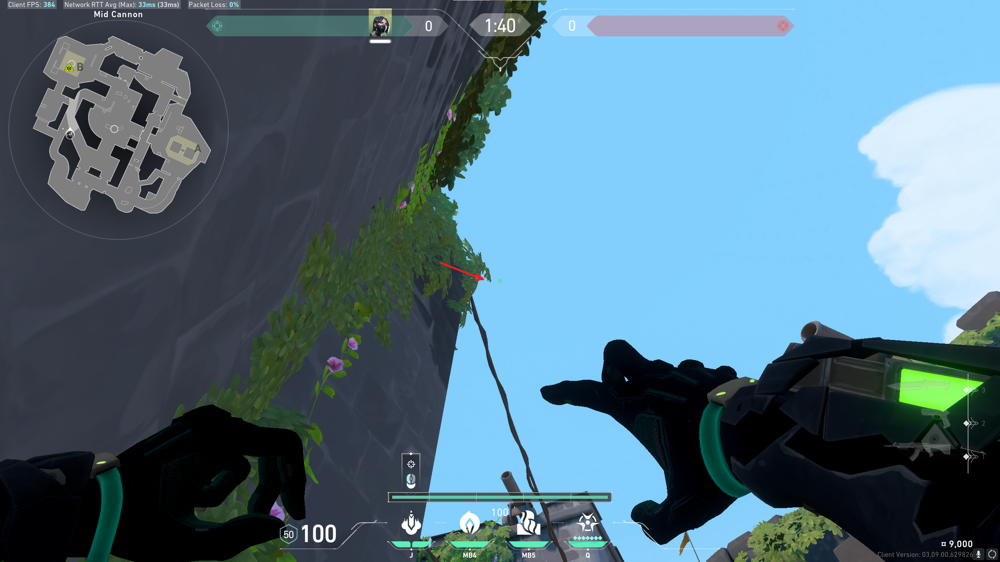

# Molly: B Front of Pillar

## Position

Stand in the corner formed by the left side of the wooden stool and the wall.

## Lineup

Aim crosshair just right of the tip of the protruding leaves (about 0.75 cm)
on my monitor). On the leaves will land it halfway between this lineup and
default, so adjust accordingly.
* Jump: NO
* Run: NO

## Result

