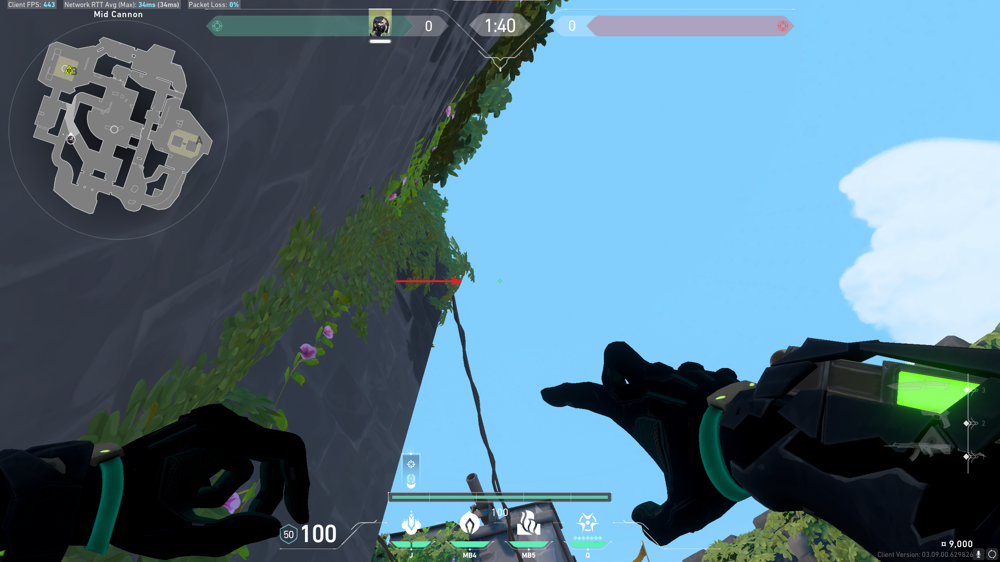

# Molly: B Right of Pillar

## Position

Stand in the corner formed by the left side of the wooden stool and the wall.

## Lineup

Aim crosshair about twice as far right of the leaves' tip as for the front of
pillar lineup (about 1.5 cm on my monitor). Crosshair should be about as far
right as it would be down for the default lineup.
* Jump: NO
* Run: NO

## Result

