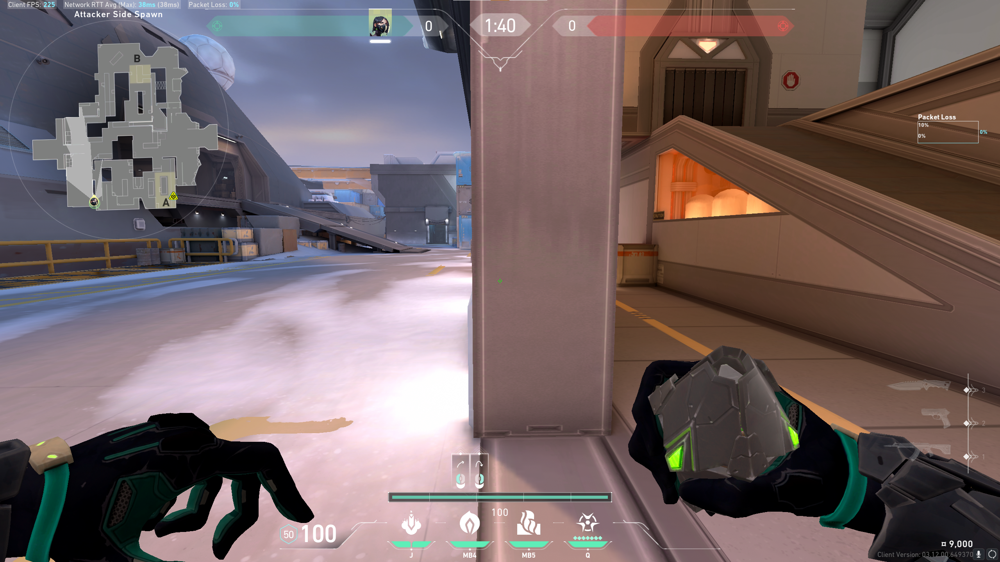
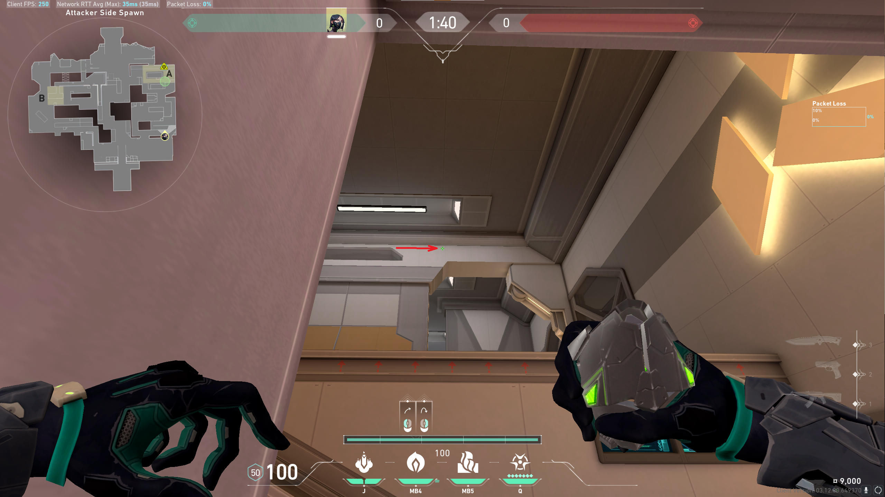
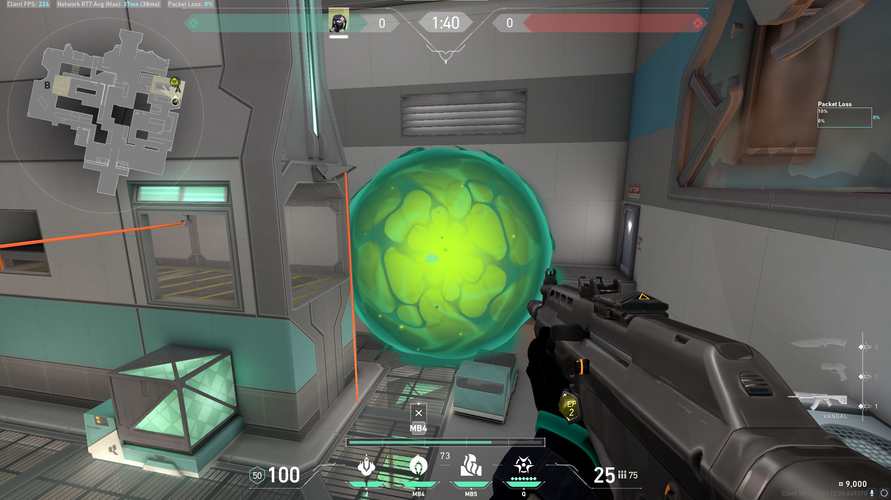

# Smoke: A Rafters

## Position

Stand against the outer edge of the wall.

## Lineup

Align crosshair with the top of the trapezoidal hole in the tall wall.
Left/right alignment doesn't matter, as long as it doesn't hit the walls
to the sides.
* LEFT-CLICK
* Jump: NO
* Run: YES

## Result

